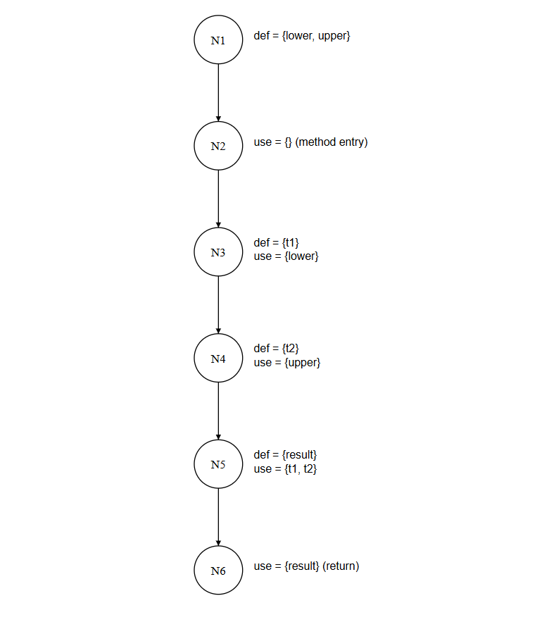
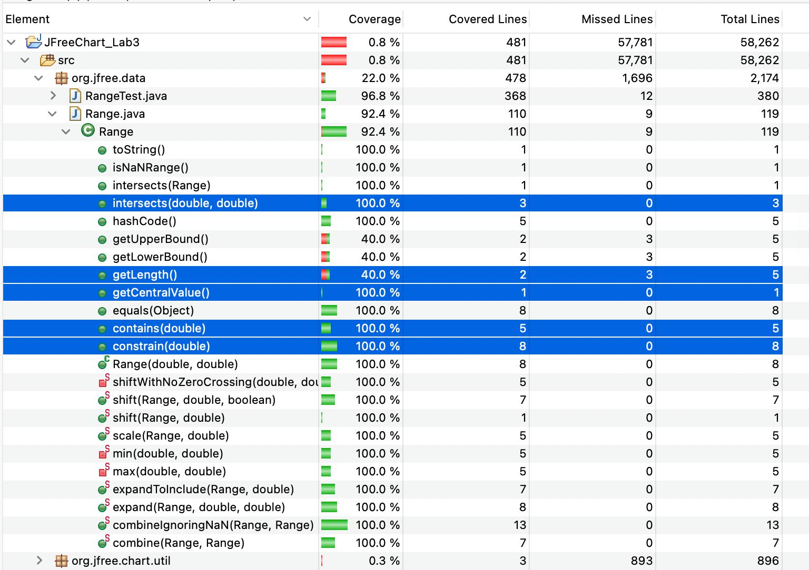
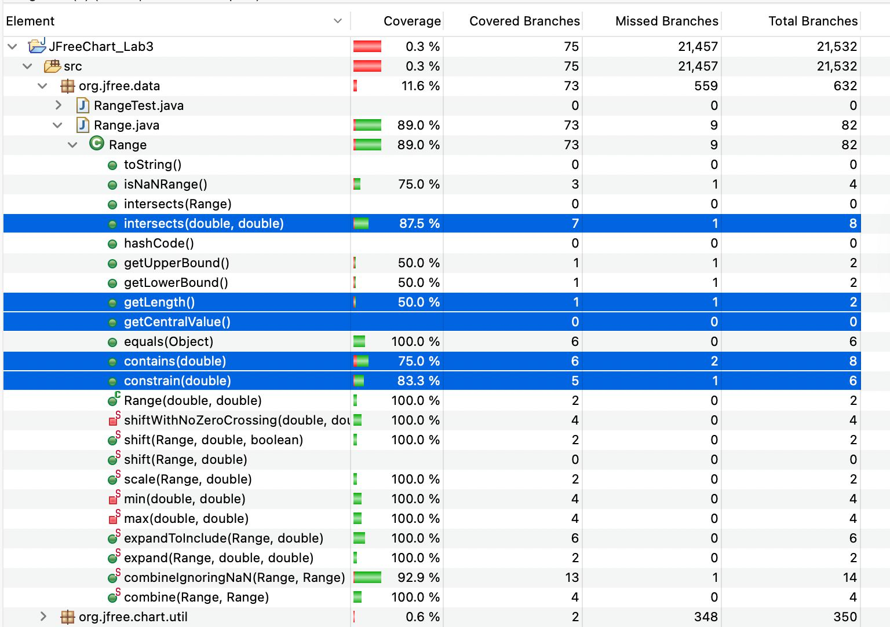
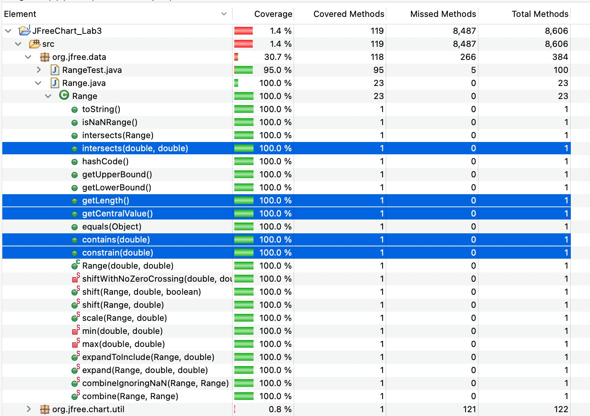
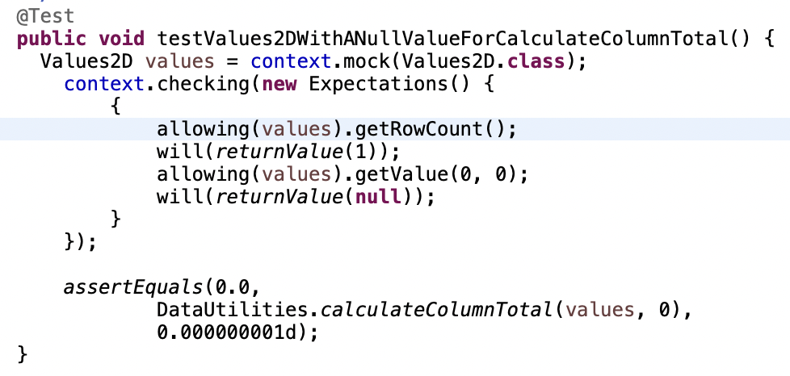
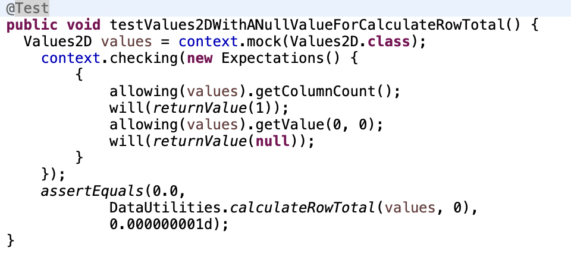
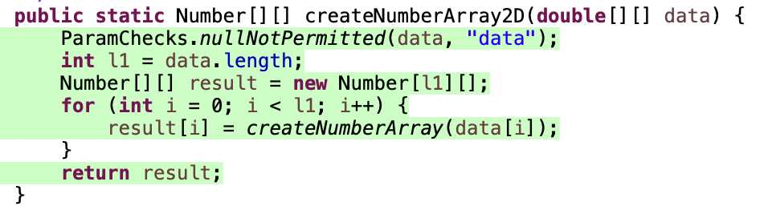
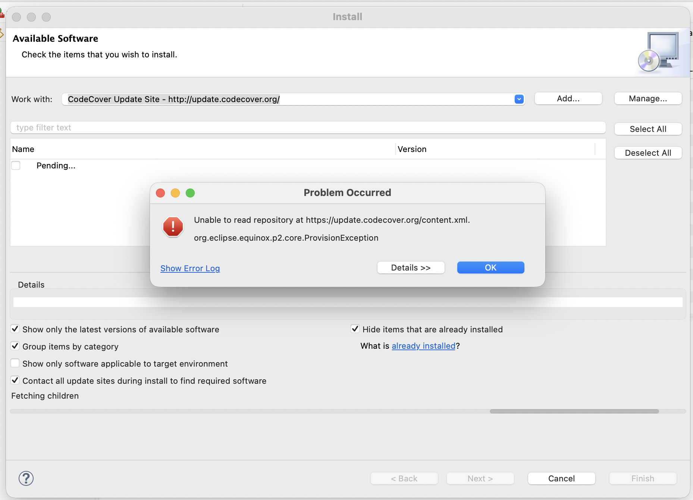
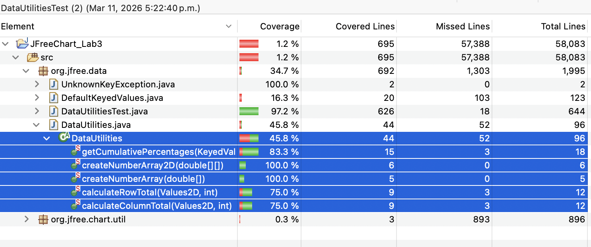

# SENG 637 - Dependability and Reliability of Software Systems

## Lab Report #3 – Code Coverage, Adequacy Criteria and Test Case Correlation

| Group: 9 |
| -------- |
| Maheen   |
| Dipu     |
| Jasdeep  |
| Dhruvi   |

---

# 1 Introduction

Software reliability depends heavily on the quality and adequacy of the testing process. Unit testing is one of the most widely used techniques for verifying the correctness of individual components in a software system. In addition to validating functional behavior, modern testing practices emphasize evaluating the adequacy of a test suite using structural analysis techniques. White-box testing provides a systematic way to achieve this by analyzing the internal structure of the source code and ensuring that test cases exercise critical execution paths.

This assignment focuses on evaluating and improving the adequacy of a unit test suite using code coverage criteria. Code coverage metrics provide quantitative indicators of how thoroughly a test suite exercises the system under test (SUT). Common structural coverage criteria include statement coverage, branch (decision) coverage, and condition coverage, each representing a progressively stronger level of testing completeness. By measuring these metrics, testers can identify untested regions of code and design additional test cases to improve the overall quality of the test suite.

The system under test in this assignment is JFreeChart, an open-source Java framework used for creating charts and data visualizations. JFreeChart is designed to be integrated into other applications as a reusable component, making the correctness and robustness of its API functions critical. Two classes from the org.jfree.data package—DataUtilities and Range—are selected for detailed analysis and testing in this assignment.

To perform the testing and coverage analysis, the JUnit testing framework is used to execute unit tests within the Eclipse development environment, while coverage tools are used to measure structural coverage metrics. Coverage tools help identify the portions of code that are executed by the existing test suite and reveal areas that require additional test cases to achieve higher coverage.

In addition to automated coverage measurement, this assignment also introduces data-flow testing, which examines how variables are defined and subsequently used during program execution. Data-flow coverage focuses on identifying definition-use (DU) pairs, ensuring that variable definitions propagate correctly to their uses along feasible execution paths. This analysis provides deeper insight into potential faults that may not be detected through control-flow coverage alone.

The objectives of this assignment are therefore threefold: to measure the adequacy of an existing test suite using coverage tools, to design additional unit tests that increase structural coverage, and to manually analyze data-flow coverage for selected methods. Through these activities, the assignment demonstrates how coverage-based testing techniques can be used to systematically improve test effectiveness while highlighting both the strengths and limitations of coverage metrics as indicators of software quality.

---

# 2 Manual Data-Flow Coverage Calculations for `calculateColumnTotal` and `getCentralValue` Methods

Manual data-flow analysis was conducted for the following methods within the `DataUtilities` and `Range` class:

- `calculateColumnTotal`
- `getCentralValue`

Data-flow testing evaluates the relationships between **variable definitions (def)** and **subsequent uses (use)** along feasible execution paths in the control flow of a program. The objective of this analysis is to identify **Definition–Use (DU) pairs**, which capture how data values propagate through the program and influence computation. By examining DU pairs, testers can determine whether the test suite adequately exercises all meaningful data dependencies within the system under test.

## `calculateColumnTotal`

The method `calculateColumnTotal` was selected for detailed analysis. This method computes the sum of values in a specified column of a two-dimensional dataset.


The primary variables involved in the computation include:

- `data`
- `column`
- `rowCount`
- `total`
- loop control variables (`r`, `r2`)
- intermediate numeric values (`n1`, `n2`)

### Notes

- The original loop variable `n` was renamed to **`n1` and `n2`** during analysis to avoid ambiguity when identifying definition–use relationships.

### Data Flow Graph

The **Data Flow Graph (DFG)** illustrates the propagation of variable definitions and uses across the control flow of the `calculateColumnTotal` method.


### Notes

- The `for` loop statement was decomposed into **three separate logical statements** for the purpose of data-flow analysis:
  - loop initialization
  - loop condition comparison
  - loop increment

This decomposition simplifies the identification of variable definitions and uses within iterative constructs and enables more precise tracking of DU pairs.

### Def–Use Sets per Statement

The following table summarizes the **definition and use sets for each relevant statement** in the analyzed method.

| Statement | Definition   | Use              |
| --------- | ------------ | ---------------- |
| 123       | data, column |                  |
| 124       |              | data             |
| 125       | total        |                  |
| 126       | rowCount     | data             |
| 127       | r            | r, rowCount      |
| 128       | n1           | data, r, column  |
| 129       |              | n1               |
| 130       | total        | total, n1        |
| 131       |              |                  |
| 132       |              |                  |
| 133       | r2           | r2, rowCount     |
| 134       | n2           | data, r2, column |
| 135       |              | n2               |
| 136       | total        | total, n2        |
| 137       |              |                  |
| 138       |              |                  |
| 139       |              | total            |

These def-use sets form the basis for identifying **all possible DU pairs** in the method.

### DU-Pairs per Variable

The following table lists all **Definition–Use pairs identified for each variable**.

| Variable | DU-pairs                                                                              |
| -------- | ------------------------------------------------------------------------------------- |
| data     | (123,124), (123,126), (123,128), (123,134 _not reachable_)                            |
| column   | (123,128), (123,134 _not reachable_)                                                  |
| total    | (125,130), (125,136 _not reachable_), (125,139), (130,139), (136 _not reachable_,139) |
| rowCount | (126,127), (126,133)                                                                  |
| r        | (127,127), (127,128)                                                                  |
| n1       | (128,129), (128,130)                                                                  |
| r2       | (133,133), (133,134 _not reachable_)                                                  |
| n2       | (134 _not reachable_,135 _not reachable_), (134 _not reachable_,136 _not reachable_)  |

Some DU pairs are marked as **not reachable** because the corresponding control-flow paths cannot be executed due to program logic constraints.


As the `rowCount` cannot be negative, the second for loop is unreachable.

### Reachable DU-Pairs

After removing DU pairs associated with infeasible execution paths, the **set of reachable DU pairs** is obtained.

| Variable | Reachable DU-pairs              |
| -------- | ------------------------------- |
| data     | (123,124), (123,126), (123,128) |
| column   | (123,128)                       |
| total    | (125,130), (125,139), (130,139) |
| rowCount | (126,127), (126,133)            |
| r        | (127,127), (127,128)            |
| n1       | (128,129), (128,130)            |
| r2       | (133,133)                       |
| n2       | —                               |

The DU pairs associated with variable `n2` are unreachable because the corresponding loop structure is never executed.

### DU-Pairs Covered per Test Case

The following table summarizes which DU pairs are exercised by the designed unit tests.
| | |
| ------------------------------------------------- | ------------------------------------------------------------------------------------------------------------------------------------------------------------------------------------------------------------------ |
| **Test Case Name** | **DU-pairs covered** |
| test_calculateColumnTotal_ect_1 | data: {(123, 124), (123, 126), (123, 128)}, column: {(123, 128)}, total: {(125, 130), (130, 139)}, rowCount: {(126, 127), (126, 133)}, r: {(127, 127), (127, 128)}, n1: {(128, 129), (128, 130)}, r2: {(133, 133)} |
| test_calculateColumnTotal_ect_2 | data: {(123, 124)} |
| test_calculateColumnTotal_ect_3 | data: {(123, 124), (123, 126), (123, 128)}, column: {(123, 128)}, rowCount: {(126, 127)}, r: {(127, 127 (increment not covered)), (127, 128)} |
| test_calculateColumnTotal_bvt_1 | data: {(123, 124), (123, 126), (123, 128)}, column: {(123, 128)}, total: {(125, 130), (130, 139)}, rowCount: {(126, 127), (126, 133)}, r: {(127, 127), (127, 128)}, n1: {(128, 129), (128, 130)}, r2: {(133, 133)} |
| test_calculateColumnTotal_bvt_2 | data: {(123, 124), (123, 126), (123, 128)}, column: {(123, 128)}, total: {(125, 130), (130, 139)}, rowCount: {(126, 127), (126, 133)}, r: {(127, 127), (127, 128)}, n1: {(128, 129), (128, 130)}, r2: {(133, 133)} |
| test_calculateColumnTotal_bvt_3 | data: {(123, 124), (123, 126), (123, 128)}, column: {(123, 128)}, total: {(125, 130), (130, 139)}, rowCount: {(126, 127), (126, 133)}, r: {(127, 127), (127, 128)}, n1: {(128, 129), (128, 130)}, r2: {(133, 133)} |
| test_calculateColumnTotal_bvt_4 | data: {(123, 124), (123, 126), (123, 128)}, column: {(123, 128)}, total: {(125, 130), (130, 139)}, rowCount: {(126, 127), (126, 133)}, r: {(127, 127), (127, 128)}, n1: {(128, 129), (128, 130)}, r2: {(133, 133)} |
| test_calculateColumnTotal_bvt_5 | data: {(123, 124), (123, 126), (123, 128)}, column: {(123, 128)}, total: {(125, 130), (130, 139)}, rowCount: {(126, 127), (126, 133)}, r: {(127, 127), (127, 128)}, n1: {(128, 129), (128, 130)}, r2: {(133, 133)} |
| test_calculateColumnTotal_bvt_6 | data: {(123, 124), (123, 126), (123, 128)}, column: {(123, 128)}, total: {(125, 130), (130, 139)}, rowCount: {(126, 127), (126, 133)}, r: {(127, 127), (127, 128)}, n1: {(128, 129), (128, 130)}, r2: {(133, 133)} |
| test_calculateColumnTotal_bvt_7 | data: {(123, 124), (123, 126), (123, 128)}, column: {(123, 128)}, total: {(125, 130), (130, 139)}, rowCount: {(126, 127), (126, 133)}, r: {(127, 127), (127, 128)}, n1: {(128, 129), (128, 130)}, r2: {(133, 133)} |
| test_calculateColumnTotal_bvt_8 | data: {(123, 124), (123, 126), (123, 128)}, column: {(123, 128)}, total: {(125, 130), (130, 139)}, rowCount: {(126, 127), (126, 133)}, r: {(127, 127), (127, 128)}, n1: {(128, 129), (128, 130)}, r2: {(133, 133)} |
| test_calculateColumnTotal_bvt_9 | data: {(123, 124), (123, 126), (123, 128)}, column: {(123, 128)}, total: {(125, 130), (130, 139)}, rowCount: {(126, 127), (126, 133)}, r: {(127, 127), (127, 128)}, n1: {(128, 129), (128, 130)}, r2: {(133, 133)} |
| testValues2DWithANullValueForCalculateColumnTotal | data: {(123, 124), (123, 126), (123, 128)}, column: {(123, 128)}, total: {(125, 139)}, rowCount: {(126, 127), (126, 133)}, r: {(127, 127), (127, 128)}, n1: {(128, 129)}, r2: {(133, 133)} |

These test cases are designed to exercise the feasible definition-use paths associated with the primary aggregation loop.

---

## `getCentralValue`

The method `getCentralValue` was selected for detailed analysis from the `Range` class. This method computes the midpoint of a range by averaging its lower and upper bounds.

```java
public double getCentralValue() {   // line 146
    return this.lower / 2.0 + this.upper / 2.0;   // line 147
}
```

Because the computation is expressed as a single return statement, the method was decomposed into **intermediate logical steps** for the purpose of data-flow analysis. Specifically, the return expression `this.lower / 2.0 + this.upper / 2.0` was broken into:

- **t1** = `this.lower / 2.0`
- **t2** = `this.upper / 2.0`
- **result** = `t1 + t2`
- return `result`

This decomposition enables precise identification of definition–use relationships across the intermediate computation steps.

The primary variables involved in the computation include:

- `lower`
- `upper`
- `t1` (intermediate: lower half)
- `t2` (intermediate: upper half)
- `result` (final computed central value)

### Data Flow Graph

The **Data Flow Graph (DFG)** illustrates the propagation of variable definitions and uses across the control flow of the `getCentralValue` method.



### Def–Use Sets per Statement

The following table summarizes the **definition and use sets for each node** in the analyzed method.

| Node | Statement Description      | Definition    | Use    |
| ---- | -------------------------- | ------------- | ------ |
| N1   | Method fields (parameters) | lower, upper  |        |
| N2   | Method entry               |               |        |
| N3   | t1 = lower / 2.0           | t1            | lower  |
| N4   | t2 = upper / 2.0           | t2            | upper  |
| N5   | result = t1 + t2           | result        | t1, t2 |
| N6   | return result              |               | result |

### DU-Pairs per Variable

The following table lists all **Definition–Use pairs identified for each variable**.

| Variable | DU-pairs |
| -------- | -------- |
| lower    | (N1, N3) |
| upper    | (N1, N4) |
| t1       | (N3, N5) |
| t2       | (N4, N5) |
| result   | (N5, N6) |

### Reachable DU-Pairs

Because `getCentralValue` is a straightforward linear method with no branches or loops, **all DU-pairs are reachable**. There are no infeasible paths.

| Variable | Reachable DU-pairs |
| -------- | ------------------ |
| lower    | (N1, N3)           |
| upper    | (N1, N4)           |
| t1       | (N3, N5)           |
| t2       | (N4, N5)           |
| result   | (N5, N6)           |

### DU-Pairs Covered per Test Case

The following table summarizes which DU pairs are exercised by the designed unit tests.

| Test Case Name                        | DU-pairs covered                                                                       |
| ------------------------------------- | -------------------------------------------------------------------------------------- |
| testGetCentralValueWithPositiveRange  | lower: {(N1,N3)}, upper: {(N1,N4)}, t1: {(N3,N5)}, t2: {(N4,N5)}, result: {(N5,N6)} |
| testGetCentralValueWithNegativeRange  | lower: {(N1,N3)}, upper: {(N1,N4)}, t1: {(N3,N5)}, t2: {(N4,N5)}, result: {(N5,N6)} |
| testGetCentralValueCrossingZero       | lower: {(N1,N3)}, upper: {(N1,N4)}, t1: {(N3,N5)}, t2: {(N4,N5)}, result: {(N5,N6)} |
| testGetCentralValueWithEqualBounds    | lower: {(N1,N3)}, upper: {(N1,N4)}, t1: {(N3,N5)}, t2: {(N4,N5)}, result: {(N5,N6)} |
| testGetCentralValueWithVerySmallRange | lower: {(N1,N3)}, upper: {(N1,N4)}, t1: {(N3,N5)}, t2: {(N4,N5)}, result: {(N5,N6)} |
| testGetCentralValueWithLargeRange     | lower: {(N1,N3)}, upper: {(N1,N4)}, t1: {(N3,N5)}, t2: {(N4,N5)}, result: {(N5,N6)} |
| testGetCentralValueWithDecimals       | lower: {(N1,N3)}, upper: {(N1,N4)}, t1: {(N3,N5)}, t2: {(N4,N5)}, result: {(N5,N6)} |

Since `getCentralValue` has a single linear execution path, every test case that calls the method exercises all reachable DU-pairs. The full set of DU-pairs is therefore covered by the existing test suite, and no additional test cases are required.

---

# 3 A detailed description of the testing strategy for the new unit test

The testing strategy for the `DataUtilities` and `Range` classes was developed based on a **coverage-driven test design approach**. The goal of this strategy was to systematically evaluate the adequacy of the existing unit tests and identify whether additional test cases were required to achieve higher levels of structural coverage.

The testing process involved the following steps:

1. **Identifying infeasible code paths**
2. **Evaluating line coverage**
3. **Evaluating branch coverage**
4. **Evaluating method coverage**
5. **Performing data flow analysis**

Each stage was used to determine whether additional test cases were necessary to improve coverage.

---

## Test Plan for `DataUtilities`

### Infeasible Code Paths

During inspection of the source code, several infeasible paths were identified. These paths correspond to sections of code that cannot be executed due to logical constraints in the program.

#### calculateColumnTotal


In the `calculateColumnTotal` method, the second loop contains the following condition:

```
for (int r2 = 0; r2 > rowCount; r2++)
```

Because `rowCount` represents the number of rows in the dataset and therefore cannot be negative, the condition `r2 > rowCount` evaluates to **false during the first iteration**. As a result, the entire loop body becomes unreachable.

#### calculateRowTotal


A similar structure exists in the `calculateRowTotal` method. The second loop contains the condition:

```
for (int c2 = 0; c2 > columnCount; c2++)
```

Since `columnCount` cannot be negative, the loop condition is never satisfied, making this loop unreachable.

#### getCumulativePercentages


The method `getCumulativePercentages` also contains a second loop that depends on the condition:

```
for (int i2 = 0; i2 > data.getItemCount(); i2++)
```

Because `data.getItemCount()` represents the number of items in the dataset and cannot be negative, the condition is never satisfied, resulting in an unreachable loop body.

These infeasible paths reduce the maximum achievable structural coverage for the methods.

### Test Cases for Line Coverage

Line coverage was evaluated to determine whether all executable statements were exercised by the existing test suite.

#### createNumberArray

No additional test cases were required because the existing tests already cover the **maximum number of feasible lines**.


_Figure: Line coverage visualization for the `createNumberArray(double[] data)` method showing that all executable statements are exercised by the existing test suite._

#### createNumberArray2D

No additional test cases were required since all feasible lines were already covered.


_Figure: Line coverage visualization for the `createNumberArray2D` method showing that all executable statements are covered by the existing test suite._

#### calculateColumnTotal

All feasible statements were already covered by the existing test cases.


#### calculateRowTotal

Similarly, the maximum feasible line coverage was already achieved.


#### getCumulativePercentages

The existing tests already achieved the maximum feasible line coverage.


### Line Coverage Results

The coverage results confirm that all feasible lines have been executed.


These results represent **maximum feasible coverage**, since unreachable code cannot be executed.

### Test Cases for Branch Coverage

Branch coverage analysis was conducted to determine whether both true and false outcomes of conditional expressions were exercised.

#### createNumberArray

No additional test cases were required because all feasible branches were already covered.


#### createNumberArray2D

No additional test cases were required.


#### calculateColumnTotal

One additional test case was created to exercise the condition in **line 129** by inserting a **null value into the `Values2D` dataset**.


#### calculateRowTotal

Similar to `calculateColumnTotal`, an additional test case was added to cover the conditional check by inserting a **null value into the dataset**.


#### getCumulativePercentages

No additional test cases were required because the maximum feasible branch coverage had already been achieved.


### Branch Coverage Results

These results correspond to the **maximum achievable coverage considering infeasible paths**.


### Test Cases for Method Coverage

Because none of the evaluated coverage tools supported **condition coverage**, method coverage was used as an alternative metric.

No additional test cases were required since all methods were already exercised by the test suite.


---

### Data Flow Coverage

Finally, data flow coverage was analyzed for the `calculateColumnTotal` method to evaluate whether the designed test cases exercised the identified **definition–use pairs**.

As given above in Section 2, all DU-pairs were covered by our existing test cases, so no new test cases were designed.

---

## Test Plan for `Range`

### Infeasible Code Paths

During inspection of the `Range` source code, infeasible branches were identified in three instance methods: `getLowerBound()`, `getUpperBound()`, and `getLength()`. Each of these methods contains an internal conditional that checks whether `lower > upper` and logs an error message if so. However, the `Range(double, double)` constructor already enforces `lower <= upper` at object construction time by throwing an `IllegalArgumentException`. Because no `Range` object can ever exist with `lower > upper`, the error-handling branch inside each of these methods is permanently unreachable. These infeasible branches reduce the maximum achievable branch coverage for the class.

### Test Cases for Line Coverage

Line coverage was evaluated to determine whether all executable statements in the `Range` class were exercised by the existing test suite.

#### `getCentralValue`

No additional test cases were required. The existing tests from Assignment 2 already exercised all statements in this method.

#### `getLength`

No additional test cases were required. All feasible lines were already covered by the existing test suite.

#### `contains`

No additional test cases were required for line coverage. All executable statements were already reached by the existing tests.

#### `constrain`

No additional test cases were required for line coverage. All feasible statements were already covered.

#### `intersects(double, double)`

No additional test cases were required for line coverage. All executable statements were already covered by the existing tests.

#### `Range(double, double)`, `getLowerBound`, `getUpperBound`, `intersects(Range)`, `combine`, `combineIgnoringNaN`, `expandToInclude`, `expand`, `shift(Range, double)`, `shift(Range, double, boolean)`, `scale`, `equals`, `isNaNRange`, `hashCode`, `toString`

These methods had **zero line coverage** in the original test suite. New white-box test cases were designed and added to exercise all statements in each of these methods, achieving **100% line coverage** across the entire `Range` class.

### Line Coverage Results

The coverage results confirm that all feasible lines in the `Range` class have been executed.



_Figure: Method coverage report for the Range class (5 selected class)._

These results represent **maximum feasible coverage**, since the unreachable error-handling branches in `getLowerBound`, `getUpperBound`, and `getLength` do not contain additional executable statements beyond what is already covered.

### Test Cases for Branch Coverage

Branch coverage analysis was conducted to determine whether both true and false outcomes of conditional expressions were exercised.

#### `getCentralValue`

`getCentralValue` contains no conditional statements and therefore has no branches. The coverage tool correctly reports 0/0 branches for this method. No test cases were required.

#### `getLowerBound`, `getUpperBound`, and `getLength`

The single missed branch in each of these methods is the infeasible `lower > upper` internal check described above. No additional test cases were required or possible for these branches.

#### `contains(double)`

The original test suite did not cover all branch outcomes. Additional test cases were added targeting values at and just outside the lower and upper bounds to exercise all feasible true/false outcomes of the two conditional checks.

#### `constrain(double)`

The original tests did not cover the branch where the value is already within the range (no clamping applied). An additional test case with a midpoint value was added to exercise this branch.

#### `intersects(double, double)`

Two additional test cases were added to cover the remaining branch outcomes:

- `testIntersectsB0BelowLowerB1AtLower` — exercises the branch where `b0 <= lower` is true but `b1 > lower` is false, returning false
- `testIntersectsB0AtUpper` — exercises the branch where `b0 >= upper`, returning false

#### `isNaNRange`

The original test suite did not call `isNaNRange` at all. Two test cases were added:

- `testIsNaNRangeBothNaN` — both bounds are `Double.NaN`, exercising the true branch
- `testIsNaNRangeNeitherNaN` — both bounds are normal numbers, exercising the false branch

The case where only one bound is NaN represents a remaining uncovered branch due to short-circuit evaluation.

#### `combineIgnoringNaN`

Multiple new test cases were added to cover the NaN-checking branches, including cases where one or both ranges are null, one or both are NaN ranges, and combinations. One branch in the internal `min`/`max` NaN-handling logic remains uncovered as it is not reachable with well-formed inputs.

#### All remaining newly added methods

All remaining methods (`Range` constructor, `intersects(Range)`, `combine`, `expandToInclude`, `expand`, `shift(Range, double)`, `shift(Range, double, boolean)`, `scale`, `equals`, `hashCode`, `toString`) achieved full branch coverage through the new white-box test cases.

### Branch Coverage Results

These results correspond to the **maximum achievable branch coverage considering infeasible paths**.



_Figure: Branch coverage report for the Range class._

### Test Cases for Method Coverage

Because none of the evaluated coverage tools supported **condition coverage**, method coverage was used as an alternative metric to ensure that each method in the class was invoked at least once during testing.

The original test suite invoked only 5 of the 23 methods in the `Range` class. After adding white-box tests for all untested methods, **100% method coverage** was achieved — all 23 methods were exercised with 0 missed methods.



_Figure: Method coverage report for the Range class ._

---

### Data Flow Coverage

Data flow coverage was analyzed for the `getCentralValue` method to evaluate whether the designed test cases exercised the identified definition–use pairs.

As given above in Section 2, all DU-pairs for `getCentralValue` are reachable and were covered by the existing test cases. No new test cases were required.

---

# 4 A high level description of five selected test cases you have designed using coverage information, and how they have increased code coverage

---

## `DataUtilities` class

### Test Case 1 – Add a null value to the column in `Values2D data` for `calculateColumnTotal` method

This test case uses a dataset with a null value in the column as input to `calculateColumnTotal` method.

To increase branch coverage at **line 129** by inserting a **null value into the `Values2D` dataset**.


_Coverage before the test case_

#### Test case code



### Test Case 2 – Add a null value to the row in `Values2D data` for `calculateRowTotal` method

This test case uses a dataset with a null value in the row as input to `calculateRowTotal` method.

To increase branch coverage by inserting a **null value into the `Values2D` dataset**.


_Coverage before the test case_

#### Test case code



---

## `Range` class

### Test Case 3 – `testConstructorLowerGreaterThanUpper` for `Range(double, double)`

**Coverage target:** Branch coverage in the `Range` constructor

**Branch coverage before:** The branch where `lower > upper` throws an `IllegalArgumentException` was not exercised by the original test suite, as all existing tests constructed ranges with valid bounds.

The `Range(double, double)` constructor checks whether `lower > upper` and throws an `IllegalArgumentException` if so. This branch is critical because it is also the reason the error-handling branches in `getLowerBound`, `getUpperBound`, and `getLength` are infeasible — without it, invalid ranges could exist. Testing this branch directly verifies the constructor enforces its contract.

```java
@Test(expected = IllegalArgumentException.class)
public void testConstructorLowerGreaterThanUpper() {
    new Range(5.0, 1.0);
}
```

**Coverage improvement:** Exercises the previously uncovered `lower > upper` true branch in the constructor, achieving 100% branch coverage for `Range(double, double)`.

---

### Test Case 4 – `testIntersectsB0BelowLowerB1AtLower` for `intersects(double, double)`

**Coverage target:** Branch coverage in `intersects(double, double)`

**Branch coverage before:** 87.5% (7/8 branches). The original test suite tested overlapping and fully disjoint ranges but missed the case where a range ends exactly at the lower bound of this range — touching but not overlapping.

The `intersects(double, double)` method first checks `if (b0 <= this.lower)` and, if true, evaluates `return (b1 > this.lower)`. The original tests always satisfied `b1 > lower` when entering this branch. This test provides `b0 = 0.0` and `b1 = 2.0` against a range `[2.0, 8.0]`, so `b0 <= lower` is true but `b1 > lower` is false, hitting the uncovered false outcome.

```java
@Test
public void testIntersectsB0BelowLowerB1AtLower() {
    Range r = new Range(2.0, 8.0);
    assertFalse(r.intersects(0.0, 2.0));
}
```

**Coverage improvement:** Covers the false outcome of `b1 > this.lower`, increasing `intersects(double, double)` branch coverage from 87.5% to its maximum feasible coverage.

---

### Test Case 5 – `testCombineIgnoringNaNRange1NullRange2NaN` for `combineIgnoringNaN`

**Coverage target:** Branch coverage in `combineIgnoringNaN(Range, Range)`

**Branch coverage before:** The `combineIgnoringNaN` method had zero coverage in the original test suite as it was never called. After adding basic tests, the branch where `range1 == null` and `range2.isNaNRange()` evaluates to true — returning null — remained uncovered.

The method first checks if `range1 == null`. If true, it then checks `range2.isNaNRange()`. If that is also true, the method returns null rather than returning `range2`. This nested branch was not exercised by simpler null tests that passed in a valid `range2`. This test provides a NaN range as `range2` to trigger the inner branch.

```java
@Test
public void testCombineIgnoringNaNRange1NullRange2NaN() {
    Range nanRange = new Range(Double.NaN, Double.NaN);
    assertNull(Range.combineIgnoringNaN(null, nanRange));
}
```

**Coverage improvement:** Exercises the nested `range2.isNaNRange() == true` branch inside the `range1 == null` condition, contributing to the 92.9% branch coverage achieved for `combineIgnoringNaN` and covering a method with zero coverage in the original test suite.

---

# 5 A detailed report of the coverage achieved of each class and method

Coverage analysis was conducted to evaluate the adequacy of the test suite for the `DataUtilities` and `Range` classes. The analysis focused on three structural coverage metrics:

- **Line coverage**
- **Branch coverage**
- **Method coverage**

These metrics provide quantitative insight into how effectively the unit tests exercise the internal logic of the system under test.

---

## Coverage for `DataUtilities` class

### Line Coverage Results

Line coverage measures the proportion of executable statements that are executed during test execution.

The coverage analysis showed that several methods in the `DataUtilities` class already achieved **maximum feasible line coverage**. In particular, the following methods required **no additional test cases** because all reachable statements were already exercised by the existing tests:

- `createNumberArray`
- `createNumberArray2D`
- `calculateColumnTotal`
- `calculateRowTotal`
- `getCumulativePercentages`

The line coverage results are shown below.


*Figure: Coverage report for the DataUtilities class showing the percentage of coverage achieved for each method.*

According to the coverage report, the `DataUtilities` class achieved a high level of statement execution, and the remaining uncovered lines correspond primarily to infeasible code paths. The coverage table presented in the screenshot illustrates the percentage of covered lines and the number of executed statements for each method.

### Branch Coverage Results

Branch coverage evaluates whether both outcomes of conditional expressions (true and false) have been exercised by the test suite.

For most methods in the `DataUtilities` class, the existing tests already covered all feasible branches. However, two additional test cases were introduced to increase branch coverage as mentioned before.


### Method Coverage Results

Because none of the evaluated coverage tools supported **condition coverage**, method coverage was used as an alternative metric to ensure that each method in the class was executed at least once during testing.

The results indicate that **all methods in the `DataUtilities` class were executed by the test suite**, and therefore no additional tests were required to improve method coverage.


The method coverage table illustrates the number of methods executed during testing and confirms that the test suite successfully invokes each method under analysis.

---

### Interpretation of Coverage Results

The coverage analysis demonstrates that the test suite achieves **maximum feasible structural coverage** for the `DataUtilities` class. Remaining uncovered code segments correspond to **infeasible paths**, such as loop conditions that cannot evaluate to true due to program constraints.

Consequently, additional test cases cannot increase coverage beyond the levels reported above.

---

## Coverage for `Range` class

### Line Coverage Results

Line coverage measures the proportion of executable statements that are executed during test execution.

The original test suite only exercised five methods in the `Range` class. After adding white-box tests, all 23 methods achieved **100% line coverage**. The following methods required new test cases to be written because they had zero line coverage before:

- `Range(double, double)`, `getLowerBound`, `getUpperBound`, `intersects(Range)`, `combine`, `combineIgnoringNaN`, `expandToInclude`, `expand`, `shift(Range, double)`, `shift(Range, double, boolean)`, `scale`, `equals`, `isNaNRange`, `hashCode`, `toString`

The following methods were already covered by the original test suite and required no additional tests:

- `getCentralValue`, `getLength`, `contains`, `constrain`, `intersects(double, double)`

The line coverage results are shown below.


_Figure: Method coverage report for the Range class (5 selected class)._

These results represent **maximum feasible line coverage**. The unreachable error-handling branches in `getLowerBound`, `getUpperBound`, and `getLength` do not affect line coverage since all their reachable statements are exercised.

### Branch Coverage Results

Branch coverage evaluates whether both outcomes of conditional expressions (true and false) have been exercised by the test suite.

The `Range` class achieved **89% branch coverage** (73 out of 82 branches) after adding new test cases. The 9 missed branches are all infeasible:

- **`getLowerBound`, `getUpperBound`, `getLength`** (1 missed branch each): Each method contains an internal `lower > upper` check whose error-handling branch can never be reached, because the constructor already prevents any `Range` object with `lower > upper` from being created.
- **`combineIgnoringNaN`** (1 missed branch): One edge case in the internal `min`/`max` NaN-handling logic is not reachable with well-formed inputs.
- **`getCentralValue`** (0 branches total): No conditional statements exist in this method; the tool correctly reports 0/0.

These results correspond to the **maximum achievable branch coverage considering infeasible paths**.


_Figure: Branch coverage report for the Range class._

### Method Coverage Results

Because none of the evaluated coverage tools supported **condition coverage**, method coverage was used as an alternative metric to ensure that each method in the class was executed at least once during testing.

The original test suite invoked only **5 of the 23 methods** in the `Range` class. After adding white-box tests, **100% method coverage** was achieved — all 23 methods were exercised with 0 missed methods.


_Figure: Method coverage report for the Range class ._

---

### Interpretation of Coverage Results

The coverage analysis demonstrates that the augmented test suite achieves near-maximum feasible structural coverage for the `Range` class. **100% line coverage** and **100% method coverage** were achieved across all 23 methods. The 9 remaining uncovered branches (out of 82, giving 89% branch coverage) all correspond to infeasible paths — the `lower > upper` error-handling checks inside `getLowerBound`, `getUpperBound`, and `getLength`, which the constructor makes permanently unreachable, and one NaN edge case in `combineIgnoringNaN`. No additional test cases can increase coverage beyond these limits.

---

# 6 Pros and Cons of coverage tools used and Metrics you report

Several coverage tools were evaluated during this lab in order to measure the adequacy of the test suite and analyze structural coverage of the `DataUtilities` class. The tools considered include **CodeCover**, **Clover**, **JaCoCo**, and **Coverlipse**. These tools provide different levels of support for coverage metrics such as statement coverage, branch coverage, and method coverage.

However, one major limitation encountered during the experiment was the lack of support for **condition coverage** among the available tools.

---

## CodeCover

CodeCover is a coverage tool designed to support advanced coverage metrics including condition coverage and MC/DC (Modified Condition/Decision Coverage), making it one of the few tools capable of satisfying stricter testing standards.

During the lab, an attempt was made to install the **CodeCover Eclipse plugin** using the standard Eclipse update mechanism.



_Installation steps for the CodeCover Eclipse plugin using the Eclipse update mechanism._

However, an error occurred during installation, preventing the plugin from being successfully installed in the development environment.



_Error encountered while attempting to install the CodeCover Eclipse plugin due to the repository not being accessible._

Because of this installation failure, CodeCover could not be used for the coverage analysis.

### Advantages

- Supports advanced structural coverage metrics including **condition coverage** and MC/DC, which are unavailable in most other tools
- Designed specifically for white-box testing analysis and safety-critical testing standards
- Provides detailed, per-condition coverage reports that help identify exactly which boolean sub-expressions are untested
- Integrates with Eclipse via a dedicated plugin when installation succeeds

### Disadvantages

- **Severe installation issues** — the Eclipse plugin repository was inaccessible during the lab, making the tool completely unusable
- Requires additional manual configuration within Eclipse even when installation succeeds, making setup time-consuming
- The plugin has not been actively maintained and is incompatible with newer versions of Eclipse, leading to frequent crashes and dependency conflicts
- Very poor user-friendliness due to outdated documentation and a steep learning curve
- Less commonly used in modern development workflows, meaning community support and troubleshooting resources are limited

---

## Clover

Clover is a widely used code coverage tool developed by Atlassian, integrated with development environments such as Eclipse and IntelliJ. It was evaluated as an alternative to CodeCover after the CodeCover installation failed.

Clover supports several basic coverage metrics including:

- **Statement coverage**
- **Branch coverage**
- **Method coverage**

However, Clover does **not support condition coverage**, which limits its usefulness when evaluating complex boolean expressions.



_Figure: Clover documentation describing the supported coverage metrics including statement coverage, branch coverage, and method coverage._

### Advantages

- Straightforward integration with Eclipse and IntelliJ via plugin, with a relatively smooth installation process compared to CodeCover
- Provides clear, visually appealing coverage reports with colour-coded highlighting (green for covered, red for uncovered) directly in the IDE source view
- Supports multiple coverage metrics and produces per-method and per-class summaries
- User-friendly interface that is easy to navigate, even for those unfamiliar with coverage tools
- Actively maintained with good documentation and community support

### Disadvantages

- Does **not support condition coverage**, which was the primary metric required for this assignment
- Limited ability to analyze individual boolean sub-expressions within complex conditional statements
- The free version has restrictions; full functionality requires a commercial licence, which may limit accessibility in academic settings
- Coverage instrumentation can slightly slow down test execution for large projects

---

## JaCoCo

JaCoCo (Java Code Coverage) is one of the most widely used Java coverage tools, commonly integrated into Eclipse via the EclEmma plugin. It was the primary tool used for coverage analysis in this lab.

According to the JaCoCo documentation, the tool supports:

- instruction coverage
- line coverage
- branch coverage
- method coverage

However, JaCoCo also **does not support condition coverage**.
https://www.jacoco.org/jacoco/trunk/doc/counters.html

### Advantages

- **Excellent IDE integration** — the EclEmma plugin for Eclipse installs cleanly and without configuration issues, making it immediately usable
- Lightweight with minimal impact on test execution speed
- Produces colour-coded in-editor highlighting (green for covered lines, red for missed, yellow for partially covered branches) which is highly intuitive and user-friendly
- Integrates seamlessly with build tools such as Maven and Gradle, making it suitable for both IDE-based and automated CI/CD workflows
- Actively maintained with thorough documentation and a large user community
- Free and open-source with no licence restrictions

### Disadvantages

- Does **not support condition coverage**, meaning individual boolean sub-expressions within compound conditions cannot be individually assessed
- Branch coverage in JaCoCo operates at the bytecode level, which can sometimes produce counter-intuitive results that do not directly map to source-level branches
- Limited analysis of compound logical conditions makes it insufficient for safety-critical testing requirements

---

## Coverlipse

Coverlipse is an Eclipse plugin designed to provide coverage analysis for Java projects directly within the IDE. It was evaluated as an additional option during the lab.

Similar to the other tools evaluated, Coverlipse provides support for several coverage metrics but **does not support condition coverage**.
https://coverlipse.sourceforge.net/faq.php.html

### Advantages

- Simple installation as an Eclipse plugin with minimal configuration required
- Provides quick inline visualization of executed code directly in the Eclipse editor
- Lightweight and unobtrusive during test execution
- Free and open-source

### Disadvantages

- Does **not support condition coverage**, consistent with the limitations of the other tools evaluated
- The project appears to be **no longer actively maintained**, with no recent updates, which raises concerns about long-term compatibility with newer versions of Eclipse and Java
- Limited support for advanced coverage metrics compared to JaCoCo or Clover
- Fewer features overall — lacks the detailed per-method and per-class summary reports provided by JaCoCo and Clover
- Smaller user community and limited documentation, making troubleshooting difficult
- Less user-friendly than JaCoCo due to fewer configuration options and a more basic reporting interface

---

## Coverage Metrics Reported

Due to the absence of condition coverage support in the available tools, the following coverage metrics were used in this lab:

1. **Line Coverage**
   Measures the proportion of executable statements that are executed during testing.

2. **Branch Coverage**
   Measures whether both outcomes of conditional statements are exercised.

3. **Method Coverage**
   Ensures that each method in the class is executed at least once during testing.

Method coverage was used as a **substitute metric** for condition coverage to ensure that all methods in the `DataUtilities` class were exercised during testing.

---

## Summary

The evaluation of coverage tools revealed that while several tools support basic structural coverage metrics, **none of the evaluated tools provided support for condition coverage within the lab environment**. As a result, the coverage analysis relied on line coverage, branch coverage, and method coverage to evaluate the adequacy of the test suite.

---

# 7 A comparison on the advantages and disadvantages of requirements-based test generation and coverage-based test generation

Software testing strategies can broadly be categorized into **requirements-based testing** and **coverage-based testing**. These two approaches focus on different aspects of the system and serve complementary purposes in ensuring software reliability.

Requirements-based testing derives test cases from the **functional specifications and requirements of the system**, whereas coverage-based testing derives tests from the **internal structure of the source code**. Both approaches have distinct advantages and limitations.

---

## Requirements-Based Test Generation

Requirements-based testing focuses on verifying whether the system behaves according to the functional specifications defined during the design phase. Test cases are derived directly from system requirements, use cases, and expected behaviors.

### Advantages

- Ensures that the system satisfies **functional requirements**.
- Focuses on **user-visible behavior**, making it highly relevant to real-world usage.
- Helps validate system functionality even without access to source code.
- Useful for **black-box testing scenarios**.

### Disadvantages

- May fail to exercise **internal program logic paths**.
- Some code segments may remain untested if they are not directly linked to requirements.
- Limited ability to detect **implementation-level defects**.

---

## Coverage-Based Test Generation

Coverage-based testing focuses on the internal structure of the program. Test cases are designed to exercise different parts of the source code, such as statements, branches, and paths.

### Advantages

- Ensures systematic exploration of the **program’s control flow**.
- Identifies **untested code segments**.
- Improves test completeness by ensuring that important execution paths are covered.
- Helps detect **implementation errors and hidden logical defects**.

### Disadvantages

- High coverage does not necessarily guarantee **correct functionality**.
- Some generated tests may not correspond to realistic user scenarios.
- May require access to source code and deeper understanding of program internals.

---

## Comparison of the Two Approaches

| Aspect                 | Requirements-Based Testing             | Coverage-Based Testing            |
| ---------------------- | -------------------------------------- | --------------------------------- |
| Testing focus          | Functional requirements                | Internal program structure        |
| Testing type           | Black-box testing                      | White-box testing                 |
| Test generation source | System requirements and specifications | Source code structure             |
| Primary objective      | Validate system behavior               | Ensure execution of code paths    |
| Strength               | Validates user expectations            | Detects untested code segments    |
| Limitation             | May miss internal faults               | May ignore functional correctness |

---

## Complementary Nature of Both Approaches

In practice, effective testing strategies combine both approaches. Requirements-based testing ensures that the system behaves correctly from the user’s perspective, while coverage-based testing ensures that the internal logic of the program is adequately exercised.

By integrating both methods, testers can achieve higher confidence in both **functional correctness** and **structural reliability** of the software system.

---

# 8 A discussion on how the team work/effort was divided and managed

The workload for this lab was divided among the team members to ensure efficient progress and balanced contribution. The group split the assignment based on the two main classes that required analysis and testing.

Dhruvi and Jasdeep were responsible for the **DataUtilities** class. Their tasks included performing the data-flow analysis, identifying infeasible paths, designing additional test cases, executing the tests, and analyzing the coverage results for the methods within this class. They also prepared the documentation related to the testing strategy and coverage analysis for `DataUtilities`.

Maheen and Dipu worked on the **Range** class. Their responsibilities included analyzing the source code of the class, designing test cases to improve coverage, evaluating structural coverage metrics, and documenting the testing process and results for that component.

The team coordinated regularly to ensure consistency in testing methodology, coverage analysis, and documentation style across both parts of the assignment. This division of work allowed the group to analyze both classes in depth while maintaining a structured and organized workflow throughout the lab.

---

# 9 Any difficulties encountered, challenges overcome, and lessons learned from performing the lab

During the execution of this lab, several challenges were encountered while performing the coverage analysis and designing adequate unit tests. These challenges required both manual analysis and experimentation with different testing tools.

One major difficulty was the **lack of support for condition coverage in the available coverage tools**. Several tools were evaluated, including CodeCover, Clover, JaCoCo, and Coverlipse. Although CodeCover theoretically supports condition coverage, the installation of the Eclipse plugin failed due to compatibility issues, preventing its use during the lab. The remaining tools only supported line, branch, and method coverage.

Another challenge involved identifying **infeasible code paths** in both classes. In the `DataUtilities` class, certain loop conditions in methods such as `calculateColumnTotal`, `calculateRowTotal`, and `getCumulativePercentages` were logically impossible to satisfy because the dataset size variables cannot be negative. This required careful manual inspection of the source code to determine why some lines remained uncovered during coverage analysis. A similar challenge arose in the `Range` class, where the methods `getLowerBound`, `getUpperBound`, and `getLength` each contain an internal branch that checks whether `lower > upper`. Because the `Range` constructor enforces `lower <= upper` at construction time by throwing an `IllegalArgumentException`, this branch can never be reached through any valid use of the class. Recognizing this required understanding the relationship between the constructor and the instance methods, and explaining why the resulting 89% branch coverage represents the maximum achievable rather than a gap in test design.

Performing **data-flow analysis** also presented difficulties. Determining the definition-use relationships for variables required careful tracking of variable definitions and their subsequent uses across different statements and loop structures. In addition, the for-loop constructs had to be separated into initialization, comparison, and increment statements in order to correctly construct the data-flow graph and identify DU-pairs.

Despite these challenges, the lab provided valuable experience in applying structural testing techniques. It demonstrated how coverage metrics can help identify untested parts of a program and guide the creation of additional test cases.

Overall, the lab highlighted the importance of combining **manual code analysis with automated testing tools**. It also reinforced the idea that high coverage metrics must be interpreted carefully, especially when infeasible paths exist in the program.

---

# 10 Comments/feedback on the lab itself

This lab provided valuable hands-on experience with software testing and coverage analysis. It helped demonstrate how structural testing techniques such as line coverage, branch coverage, and data-flow testing can be applied to evaluate the adequacy of a test suite. Through the analysis of the `DataUtilities` and `Range` classes, the lab illustrated how coverage metrics can reveal untested portions of code and guide the design of additional test cases.

One particularly useful aspect of the lab was the opportunity to perform **data-flow analysis manually**. Identifying definition–use pairs and constructing the data-flow graph provided deeper insight into how variables propagate through the program and how certain execution paths may become infeasible. This exercise reinforced the importance of understanding the internal structure of the code when performing white-box testing.

The lab also highlighted practical challenges associated with testing tools. Several coverage tools were evaluated, but not all of them supported the required coverage metrics, particularly condition coverage. This demonstrated that selecting appropriate testing tools is an important part of the software testing process.

Overall, the lab was effective in helping students understand the relationship between **code coverage metrics and software reliability**. It provided a practical perspective on how systematic testing approaches can improve software quality and ensure that critical execution paths are adequately tested.

---
